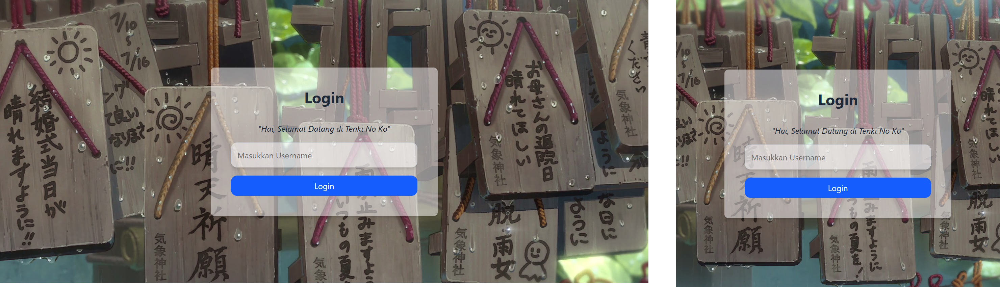
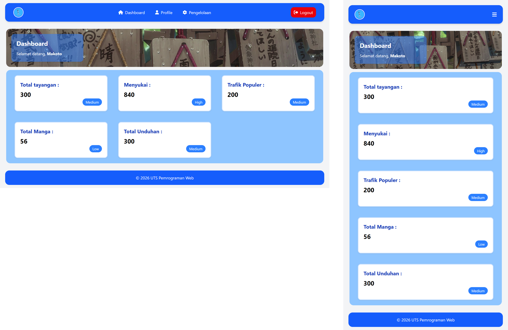
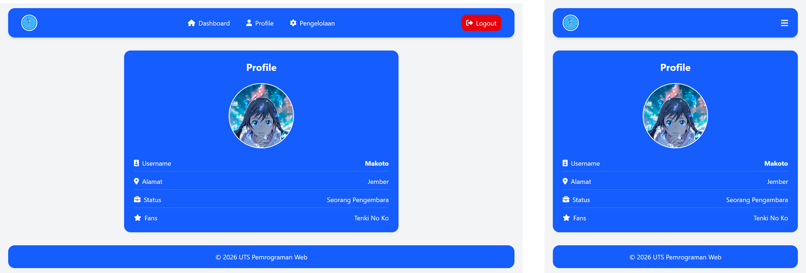
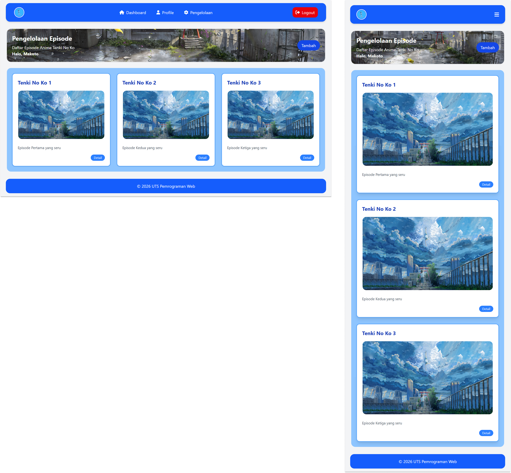

## Pengelolaan Anime Tenki No Ko
### Gambar Website :
<h2>Login</h2>

<h2>Dashboard</h2>

<h2>Profil</h2>

<h2>Pengelolaan</h2>

### Deskripsi :

Saya Adya yang sekarang membuat project UTS PWEB B yaitu Alur dari penggunaan Controller.

Disini dimulai dari fitur login yang isinya input username dan ada validasi eror jika tidak menginputkan username, disini saya juga membuat background dari asset gambar yang saya simpan di public dan folder image

Disini saya membuat pengelolaan anime dari serial Tenki No Ko yang isinya ada dashboard menampilkan data dashboard dan juga username dari inputan yang diinputkan di login untuk isinya yaitu :
<ol>
    <li>Total Tayangan</li>
    <li>Menyukai</li>
    <li>Trafik Populer</li>
    <li>Total Manga</li>
    <li>Total Unduhan</li>
    <li>Total Tayangan</li>
</ol>
Untuk datanya disini disimpan dalam array di PageController.

 
Setelah itu ada Profil yang menampilkan username dari profil dan juga data array yaitu :
<ol>
    <li>alamat</li>
    <li>status</li>
    <li>fans</li>
</ol>

Lalu ada pengelolaan disini adalah isi dari episode-episode anime Tenki No Ko yang ditambahkan dan juga get data username dari login isi dari pengelolaan :
<ol>
    <li>Judul</li>
    <li>Deskripsi</li>
</ol>

Terakhir ada logout setelah selesai user bisa logout dan semua sesi login atau username akan direset

